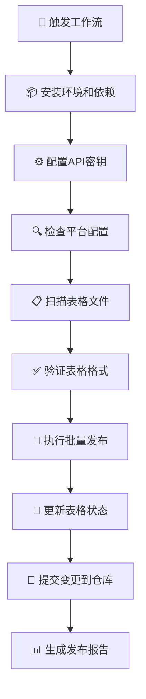

# 🤖 GitHub Actions 表格发布自动化指南

## 🎯 功能概述

通过GitHub Actions实现表格文章的全自动发布，支持：

- ⏰ **定时自动发布** - 每天3次自动检查和发布
- 🔄 **手动触发发布** - 支持指定参数的手动执行
- 📊 **状态自动更新** - 发布后自动更新表格中的状态
- 📝 **自动提交变更** - 将更新后的表格提交回仓库
- 📈 **详细发布报告** - 每次执行后生成详细报告

## ⚙️ 配置步骤

### 1. 配置API密钥（必需）

在GitHub仓库中设置以下Secrets：

**路径**: `Settings > Secrets and variables > Actions > New repository secret`

#### 必需的Secrets

| Secret名称 | 说明 | 获取方式 |
|-----------|------|----------|
| `DEVTO_API_KEY` | DEV.to API密钥 | [DEV.to Settings](https://dev.to/settings/account) |
| `HASHNODE_API_KEY` | Hashnode API密钥 | [Hashnode Settings](https://hashnode.com/settings/developer) |
| `HASHNODE_PUBLICATION_ID` | Hashnode Publication ID | 从博客URL中提取 |

#### 详细配置步骤

1. **DEV.to API密钥**
   ```
   1. 登录 https://dev.to
   2. 前往 Settings → Account → API Keys
   3. 点击 "Generate API Key"
   4. 复制生成的密钥
   5. 在GitHub仓库中添加为 DEVTO_API_KEY
   ```

2. **Hashnode API密钥**
   ```
   1. 登录 https://hashnode.com
   2. 前往 Settings → Developer → Personal Access Tokens
   3. 点击 "Generate new token"
   4. 复制生成的密钥
   5. 在GitHub仓库中添加为 HASHNODE_API_KEY
   ```

3. **Hashnode Publication ID**
   ```
   1. 进入你的Hashnode博客管理页面
   2. 查看URL：https://hashnode.com/[PUBLICATION_ID]/dashboard
   3. 复制方括号中的ID
   4. 在GitHub仓库中添加为 HASHNODE_PUBLICATION_ID
   ```

### 2. 启用GitHub Actions

确保仓库中的Actions功能已启用：

1. 前往 `Settings > Actions > General`
2. 选择 "Allow all actions and reusable workflows"
3. 在 "Workflow permissions" 中选择 "Read and write permissions"
4. 勾选 "Allow GitHub Actions to create and approve pull requests"

### 3. 添加表格文件

在仓库中添加文章表格文件：

```bash
# 生成模板文件
npm run create-template

# 或手动创建CSV文件
touch articles.csv
```

表格格式示例：
```csv
title,description,tags,content,devto_published,hashnode_published
"我的测试文章","这是一篇测试文章","test,demo","# 标题\n\n内容...",false,false
```

## 🚀 使用方法

### 自动定时发布

工作流会在以下时间自动运行：
- **北京时间**: 9:00、15:00、21:00
- **UTC时间**: 1:00、7:00、13:00

### 手动触发发布

#### 在GitHub网页上手动触发

1. 前往仓库的 `Actions` 页面
2. 选择 "📊 表格批量自动发布" 工作流
3. 点击 "Run workflow"
4. 配置参数：
   - **指定表格文件**: 可选，留空则处理所有表格
   - **发布平台**: 选择发布到哪些平台
   - **草稿模式**: 是否发布为草稿
   - **强制发布**: 是否发布已发布的文章

#### 使用GitHub CLI手动触发

```bash
# 基本触发
gh workflow run "table-auto-publish.yml"

# 指定参数触发
gh workflow run "table-auto-publish.yml" \
  -f table_file="articles.csv" \
  -f draft_mode="true" \
  -f platforms="devto,hashnode"
```

## 📊 工作流程说明

### 完整执行流程



### 处理逻辑

1. **文件检测**: 自动扫描仓库中的 `.csv`、`.xlsx`、`.xls` 文件
2. **格式验证**: 验证表格格式是否符合要求
3. **增量发布**: 只发布未发布的文章（除非指定强制发布）
4. **状态更新**: 发布成功后自动更新表格中的发布状态
5. **自动提交**: 将更新后的表格文件提交回仓库

## 📈 执行参数详解

### 手动触发参数

| 参数 | 类型 | 说明 | 默认值 | 示例 |
|------|------|------|--------|------|
| `table_file` | 字符串 | 指定处理的表格文件 | 空（处理所有） | `articles.csv` |
| `platforms` | 字符串 | 指定发布平台 | 空（所有平台） | `devto,hashnode` |
| `draft_mode` | 布尔值 | 是否发布为草稿 | `false` | `true` |
| `force_all` | 布尔值 | 强制发布所有文章 | `false` | `true` |

### 使用场景示例

#### 场景1: 测试新文章（草稿模式）
```yaml
# 参数配置
table_file: "new-articles.csv"
draft_mode: "true"
platforms: "devto"
force_all: "false"
```

#### 场景2: 批量发布到所有平台
```yaml
# 参数配置
table_file: ""  # 处理所有表格
draft_mode: "false"
platforms: ""   # 所有平台
force_all: "false"
```

#### 场景3: 强制重新发布
```yaml
# 参数配置
table_file: "articles.csv"
draft_mode: "false"
platforms: "devto,hashnode"
force_all: "true"  # 包括已发布的文章
```

## 📊 执行结果和报告

### 发布报告内容

每次执行后会生成详细报告，包含：

1. **执行信息**
   - 执行时间（北京时间）
   - 触发方式（定时/手动）
   - 执行参数

2. **平台配置状态**
   - DEV.to: ✅已配置 / ❌未配置
   - Hashnode: ✅已配置 / ❌未配置

3. **表格文件状态**
   - 发现的表格文件列表
   - 格式验证结果

4. **发布结果统计**
   - 成功发布的文件数量
   - 失败的文件数量
   - 具体错误信息

### 查看执行结果

1. **在Actions页面查看**
   - 前往 `Actions` 页面
   - 点击具体的工作流执行记录
   - 查看执行日志和报告

2. **检查提交记录**
   - 查看仓库的commit历史
   - 自动提交的消息格式：`🤖 自动更新文章发布状态 - YYYY-MM-DD HH:MM:SS`

3. **验证表格更新**
   - 检查表格文件中的发布状态列
   - 确认发布URL已正确更新

## 🛠️ 故障排除

### 常见错误及解决方案

#### 1. API密钥配置错误
```
❌ 错误: API密钥无效或已过期
解决方案:
- 检查Secrets配置是否正确
- 重新生成API密钥
- 确认密钥名称拼写正确
```

#### 2. 表格格式验证失败
```
❌ 错误: 缺少必需字段: 标题(title)
解决方案:
- 确保表格包含 title 列
- 检查列名是否正确
- 使用模板文件作为参考
```

#### 3. 权限不足
```
❌ 错误: 推送失败，可能需要检查权限设置
解决方案:
- 检查 Settings > Actions > General > Workflow permissions
- 选择 "Read and write permissions"
- 勾选创建PR的权限
```

#### 4. 文件编码问题
```
❌ 错误: 文件解析失败
解决方案:
- 确保表格文件使用UTF-8编码
- 重新保存文件并选择UTF-8编码
- 检查文件是否损坏
```

### 调试技巧

#### 1. 本地测试验证
```bash
# 运行格式验证
node test-table-validation.js

# 本地测试发布（草稿模式）
node table-publisher.js your-file.csv --draft --yes
```

#### 2. 查看详细日志
- 在Actions执行页面展开每个步骤
- 查看具体的错误信息
- 检查API响应内容

#### 3. 分步骤调试
```bash
# 只验证格式，不执行发布
node -e "
const TableParser = require('./src/utils/tableParser');
const parser = new TableParser();
parser.validateFormat('your-file.csv').then(console.log);
"
```

## 🔧 高级配置

### 自定义执行时间

修改 `.github/workflows/table-auto-publish.yml` 中的cron表达式：

```yaml
schedule:
  # 每天北京时间 6:00, 12:00, 18:00
  - cron: '0 22,4,10 * * *'  # UTC时间
```

### 添加通知功能

可以集成Slack、钉钉等通知：

```yaml
- name: 📢 发送通知
  if: always()
  uses: 8398a7/action-slack@v3
  with:
    status: ${{ job.status }}
    text: "表格发布完成: ${{ env.PUBLISHED_COUNT }} 成功, ${{ env.FAILED_COUNT }} 失败"
  env:
    SLACK_WEBHOOK_URL: ${{ secrets.SLACK_WEBHOOK }}
```

### 多环境支持

为不同环境配置不同的Secrets：

```yaml
# 生产环境
DEVTO_API_KEY_PROD
HASHNODE_API_KEY_PROD

# 测试环境  
DEVTO_API_KEY_TEST
HASHNODE_API_KEY_TEST
```

## 📚 最佳实践

### 1. 工作流程建议


### 2. 表格管理建议

- **分批发布**: 避免一次发布过多文章
- **使用草稿**: 新文章先用草稿模式测试
- **定期备份**: 保留表格文件的历史版本
- **命名规范**: 使用有意义的表格文件名

### 3. 监控和维护

- **定期检查**: 监控自动发布的执行情况
- **API限制**: 注意各平台的API使用限制
- **错误处理**: 及时处理失败的发布任务
- **密钥更新**: 定期更新API密钥

## 🎯 使用场景示例

### 场景1: 个人博客自动化

```yaml
# 每周一自动发布
schedule:
  - cron: '0 1 * * 1'  # 每周一北京时间9点

# 配置
platforms: "devto,hashnode"
draft_mode: "false"
```

### 场景2: 团队内容发布

```yaml
# 工作日定时发布
schedule:
  - cron: '0 1,5 * * 1-5'  # 工作日9点和13点

# 先发草稿，人工审核后正式发布
draft_mode: "true"
```

### 场景3: 营销内容批量发布

```yaml
# 每天3次检查新内容
schedule:
  - cron: '0 1,7,13 * * *'

# 自动发布到所有平台
force_all: "false"
platforms: ""
```

---

## 🎉 总结

通过GitHub Actions的表格发布自动化，你可以：

- ✅ **解放双手**: 全自动的文章发布流程
- ✅ **状态同步**: 自动追踪和更新发布状态
- ✅ **错误处理**: 完善的错误处理和报告机制
- ✅ **灵活配置**: 支持多种发布策略和参数
- ✅ **可靠性强**: 自动备份和版本控制

**🚀 立即开始使用GitHub Actions实现你的文章发布自动化吧！** 